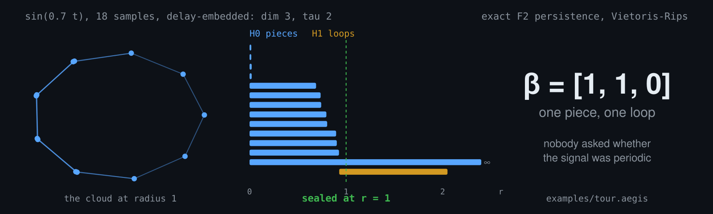
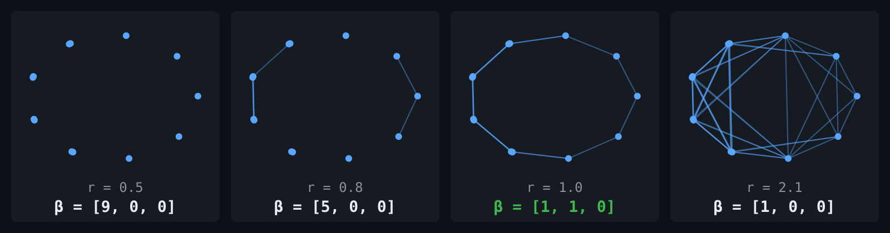
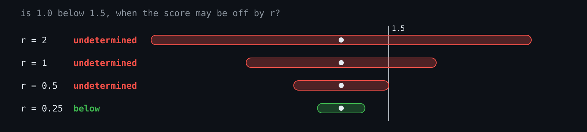
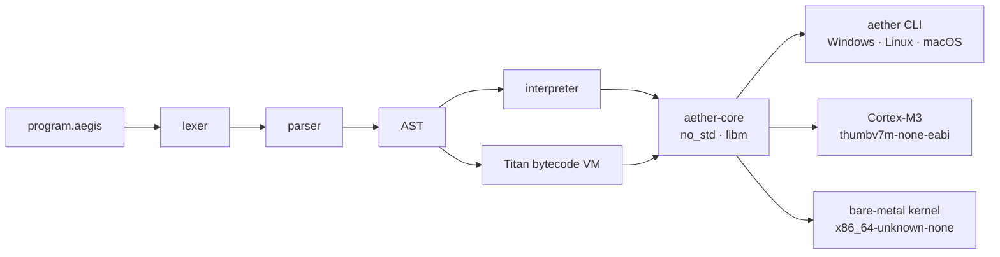

<h1 align="center">Aether</h1>

<p align="center"><b>A programming language that computes with shape.<br>Its loops end when the shape of the data stops changing, and its answers come with proof, or not at all.</b></p>



```bash
cargo run -p aether-cli -- run examples/tour.aegis
```

<p align="center">
  <a href="https://teerthsharma.github.io/Aether-Lang/"></a>
  <a href="https://doi.org/10.5281/zenodo.21997728"></a>
  <a href=".github/workflows/ci.yml"></a>
  <a href="PAPER.md#15-status"></a>
  <a href="PAPER.md#73-mutation-testing"></a>
  <a href="PAPER.md#74-the-lean-formalization"></a>
  <a href="PAPER.md#requirements"></a>
  <a href="LICENSE"></a>
</p>

<p align="center">
  <b>Invented by <a href="https://teerthsharma.vercel.app/">Teerth Sharma</a></b> · <code>teerthsharma@outlook.com</code>
</p>

---

## A loop that ends on a shape

Most programs decide things with floating-point numbers. *Keep training while the loss is above 10⁻⁶. Take the biggest score. The curves don't touch, because the distance came out positive.* A float wobbles in its last digits for reasons that have nothing to do with your data, and the program cannot tell a real change from rounding.

Aether decides with shape. Persistent homology is built into the language. Its output, the Betti numbers of a cloud of points, counts the cloud's pieces, its loops and its hollow voids. Those counts are integers. A loss that goes from 0.0341 to 0.0339 is noise, but a loop count that falls from 3 to 1 is an event. The loop keyword, `seal`, stops on events.

Here is the whole idea in one program:

```aether
import topology~
import linking~
import certify~
import math~

// Shape. A periodic signal, sampled eighteen times and delay-embedded into a
// cloud in three dimensions. Nothing below asks whether it is periodic.
let signal = []~
let t = 0~
while t < 18 {
    signal.push(sin(t * 0.7))~
    t = t + 1~
}
manifold M = embed(signal, dim=3, tau=2)~
let shape = topology.ph(M, max_dim=1, mode="vr")~

// Widen the lens until the cloud is one piece, then read its Betti numbers.
let r = 0~
🦭 until topology.betti(shape, radius=r)[0] == 1 {
    r = r + 0.25~
}
print(["one piece at radius", r, "betti", topology.betti(shape, radius=r)])~

// Certainty. A square, and a hoop threaded through it.
let square = [[0, 0, 0], [1, 0, 0], [1, 1, 0], [0, 1, 0]]~
let hoop = [[0.5, 0.5, -1], [0.5, 0.5, 1], [0.5, -0.5, 1], [0.5, -0.5, -1]]~
let link = linking_number(square, hoop)~
print(["linked?", link.verdict, "lk", link.lk, "error bound", link.error_bound])~

// Proof as a stopping rule. Is 1.0 below 1.5 when every score may be off by
// the radius? Halve it until the answer is proven.
let radius = 2~
🦭 until certified_threshold([1.0], radius, 1.5)[0] == "below" {
    print(["radius", radius, "verdict", certified_threshold([1.0], radius, 1.5)[0]])~
    radius = radius / 2~
}
print(["proven at radius", radius])~
```

```text
[one piece at radius, 1, betti, [1, 1, 0]]
[linked?, linked, lk, 1, error bound, 7.072564457345712e-14]
[radius, 2, verdict, undetermined]
[radius, 1, verdict, undetermined]
[radius, 0.5, verdict, undetermined]
[proven at radius, 0.25]
```

The program never asks whether the signal is periodic. It asks for the shape, and the answer is one piece with one hole. It never asks whether the hoop goes through the square either. It computes a linking number, and the number comes with the error bound that proves it is exactly 1. For three passes it refuses to say that 1.0 is below 1.5, because with scores that uncertain it is not yet known.

---

## How it works

1. **The data becomes a cloud.** A time series is folded into points in space. Each point pairs a sample with the samples a fixed lag behind it *(Takens delay embedding)*. A periodic signal folds into a closed loop.
2. **Every point grows a ball.** As the radius grows, balls touch. Touching points are joined, triangles fill in, and the cloud becomes a shape *(the Vietoris–Rips filtration)*.
3. **Features are born and die.** Pieces merge. Loops appear, then get filled in. Each feature's lifetime is a bar: a long bar is structure, a short bar is noise *(persistent homology, computed exactly over $\mathbb{F}_2$ by column reduction)*.
4. **Counting bars gives integers.** The bars alive at a given radius count the pieces, loops and voids *(Betti numbers)*. The counts move only when the shape really changes.
5. **The loop reads the integers.** `seal until` takes them as its stopping condition, so the program ends on an event rather than on a decimal.



The figure shows the tour's cloud at four radii, with the Betti numbers Aether reports at each:

- **0.5:** nine pieces.
- **0.8:** five pieces.
- **1.0:** one piece and **one loop**.
- **2.1:** one piece, with the loop filled in.

The loop is born at radius 0.93 and filled at 2.05. That bar is long, so it is the signal's period, not noise. The seal loop stopped inside it.

Every number in the figures is printed by Aether. [`scripts/make_readme_assets.py`](scripts/make_readme_assets.py) runs the language and draws what it says.

---

## When it says no



A confident wrong answer is worse than no answer. When Aether cannot prove something, it stops and says exactly why:

```text
linking refused: Intersecting { segment_a: 0, segment_b: 0 }
certify refused: BoundaryUndetermined { .. straddling: [1, 2] }
arrangement refused: EdgesCross { first: 0, second: 1, count: 1 }
persistent homology failed: TooManySimplices { max: 4096 }
```

Each refusal names its reason:

- **`Intersecting`:** the two curves touch, so "linked" means nothing.
- **`BoundaryUndetermined`:** scores 1 and 2 overlap within their error radii, so neither can be called the smallest.
- **`EdgesCross`:** two segments cross at a point the drawing never contains.
- **`TooManySimplices`:** the persistence engine would exceed its budget, so it refuses up front instead of discovering the problem at 40 GB resident.

None of these ever becomes a zero, a default, or a best guess.

---

## What Aether can answer

| Ask | What comes back | In a program |
|---|---|---|
| What shape is this data? | pieces, loops and voids, as integers | `topology.betti(topology.ph(M), radius=r)` |
| Are these two closed curves linked? | a linking number proven by its error bound — never a claim of "unlinked" | `linking_number(a, b).verdict` |
| Which score is smallest, really? | an argmin, top-k or threshold that no rounding within the radii could overturn | `certified_argmin(scores, radii)` |
| How many regions does this drawing enclose? | pieces, faces and Euler characteristic, with the snap radius that decided them | `euler(segments).faces` |
| Is this map one-to-one? | a collision witness, or "none at this sampling" — never "injective" | `collision_certificate(f, sampler)` |
| What symmetry does this shape have? What is its real dimension? | a recovered cyclic or dihedral group; a persistent-homology dimension | `symmetry_group(points)`, `ph_dimension(sampler)` |
| Is this system chaotic? | its Lyapunov spectrum | `lyapunov(jacobians)` |
| Where does this system settle? | a fixed point, with a contraction certificate and a rollout error bound | `coupling_fixed_point(T, c)` |
| Which cell divided, and when? | a lineage forest with certified divisions | `track(frames, gate)` |
| How many true answers can a many-to-one map recover? | proved floors on error, precision and recall | `orbit_partition(values)` |
| Softmax, kernel, or path product? | one causal attention operator, with the three as settings of its switches | `resolvent_attend(q, k, v, gates, "path")` |
| What did sparse attention skip? | witness tokens covering every segment of the context | `witness_topk(learned, topk, L, segments)` |
| How little memory does this graph need? | offsets that never overlap live tensors, and the exact transitive reduction of its dependencies | `plan_memory(tensors)`, `transitive_reduction(n, edges)` |

A decision comes with the bound that proves it, or with a typed refusal. Estimates, such as a dimension or a Lyapunov spectrum, are returned as estimates. Every row has a runnable program in [`examples/`](examples/), and the definitions and theorems are in the [documentation](https://teerthsharma.github.io/Aether-Lang/integrated/).

---

## Three ways a loop can end

```aether
🦭 until n >= 3 { ... }                               // a condition
🦭 until convergence(1e-6) { ... }                    // a tolerance
🦭 until stable(topology.betti(d, radius=r)) { ... }  // an invariant
```

| Form | Ends when |
|---|---|
| `until expr` | `expr` is true before a pass |
| `until convergence(ε)` | a pass moves the body's value by at most $\varepsilon$ in the max norm |
| `until stable(expr)` | `expr` comes through a pass unchanged — a Betti vector, a certified face count, a count of cell divisions |

`seal` and `🦭` are the same keyword. Every seal loop is capped at 1,000 passes.

---

## The mathematics underneath

Five ideas carry the language. Each is implemented in the code and pinned by tests.

**Boundaries of boundaries vanish.** Over $\mathbb{F}_2$ the boundary map sends a simplex to the sum of its faces, and $\partial_{k}\circ\partial_{k+1} = 0$. The Betti numbers count the cycles that are not themselves boundaries:

$$
\beta_k \;=\; \dim\ker\partial_k \;-\; \operatorname{rank}\partial_{k+1}.
$$

**Persistence is a matrix reduction.** Columns are added left to right until every column's lowest nonzero row is unique. This pairs each birth with its death, and the pairs are the bars of the barcode.

**Small noise moves the diagram only a little** *(Cohen-Steiner, Edelsbrunner and Harer)*. For functions $f$ and $g$ on the same space,

$$
d_B\bigl(\mathrm{Dgm}(f), \mathrm{Dgm}(g)\bigr) \;\le\; \lVert f - g\rVert_\infty .
$$

This is why a long bar can be trusted: a perturbation of size $\varepsilon$ cannot create or destroy a bar longer than $2\varepsilon$.

**Linking is an integral that must be an integer.** For closed curves $\gamma_1$ and $\gamma_2$,

$$
\mathrm{Lk}(\gamma_1,\gamma_2) \;=\; \frac{1}{4\pi}\oint\!\!\oint \frac{(\gamma_1-\gamma_2)\cdot(d\gamma_1\times d\gamma_2)}{\lVert\gamma_1-\gamma_2\rVert^3}.
$$

For polygons the integral is evaluated in closed form, as a sum of solid angles over pairs of edges. The floating-point result $\widehat{\mathrm{Lk}}$ is reported as the integer $n$ only when $\lvert \widehat{\mathrm{Lk}} - n\rvert + B < \tfrac12$, where $B$ bounds the rounding error.

**A decision is certified when no admissible error could change it.** A top-$k$ set $T$ is returned only if

$$
\max_{i\in T}\,(D_i + R_i) \;<\; \min_{j\notin T}\,(D_j - R_j),
$$

where each $R_i$ is a forward error radius built from $\gamma_n = nu/(1-nu)$ and $u$ is the unit roundoff.

[PAPER.md](PAPER.md#3-theoretical-foundation) has 29 numbered results, each with its proof and the function that implements it. The [documentation](https://teerthsharma.github.io/Aether-Lang/) covers the rest, drawn live.

---

## From a laptop to bare metal



The mathematics is `no_std` Rust against `libm`. The engine that answers `topology.ph` in your terminal also builds for a microcontroller with no operating system. It links into a kernel that owns its own allocator and scheduler. The goal is topology that makes decisions inside a running program, not topology that describes data afterwards in a notebook.

---

## Quick start

```bash
git clone https://github.com/teerthsharma/Aether-Lang
cd Aether-Lang
cargo run -p aether-cli -- run examples/tour.aegis     # the program above
cargo run -p aether-cli -- run examples/hopf_link.aegis
cargo run -p aether-cli -- repl                        # statements end with ~
cargo test --workspace --exclude aether-kernel         # 448 pass, 80 ignored
```

The toolchain is nightly Rust, pinned in [`rust-toolchain.toml`](rust-toolchain.toml). Every example program is listed in [PAPER.md](PAPER.md#example-programs).

---

## Where it stands

**Working:**

- **Persistence engine.** An exact engine computes pieces, loops and voids ($H_0$–$H_2$).
- **Evidence.** 448 tests pass, including 12 property invariants such as the stability theorem. All 52 of 52 injected mutants were caught.
- **Formal core.** 48 Lean theorems, with no `sorry`.
- **Targets.** The core builds for a Cortex-M3 and for bare x86_64.

**Open:**

- **The premise is untested.** Nobody has measured whether stopping on a topological event beats a well-tuned scalar tolerance on real problems.
- **No external parity.** Results have not been checked against ripser or GUDHI.
- **GPU not wired in.** A GPU backend exists, but the language does not call it.
- **Kernel not booted.** The kernel compiles; it has never been booted.

[What we got wrong](PAPER.md#8-negative-results-what-we-got-wrong) lists six claims this project made and then withdrew, with the numbers that killed them.

---

## Read further

- **[PAPER.md](PAPER.md)** is the technical account:
  - the theory, as 29 numbered results;
  - the language definition;
  - the implementation, crate by crate;
  - the evaluation, with controls;
  - verification through tests, mutants and Lean;
  - negative results and limitations.
- **[Documentation](https://teerthsharma.github.io/Aether-Lang/)**: every theorem and algorithm, visualised live.
- **[Integrated Mathematics](https://teerthsharma.github.io/Aether-Lang/integrated/)**: the certified library, module by module.

---

<p align="center">
  <b>Aether</b> · invented by <a href="https://teerthsharma.vercel.app/">Teerth Sharma</a> · © 2026 · <a href="LICENSE">Custom Attribution license</a><br>
  <sub>Cite as <a href="https://doi.org/10.5281/zenodo.21997728">doi:10.5281/zenodo.21997728</a></sub>
</p>
