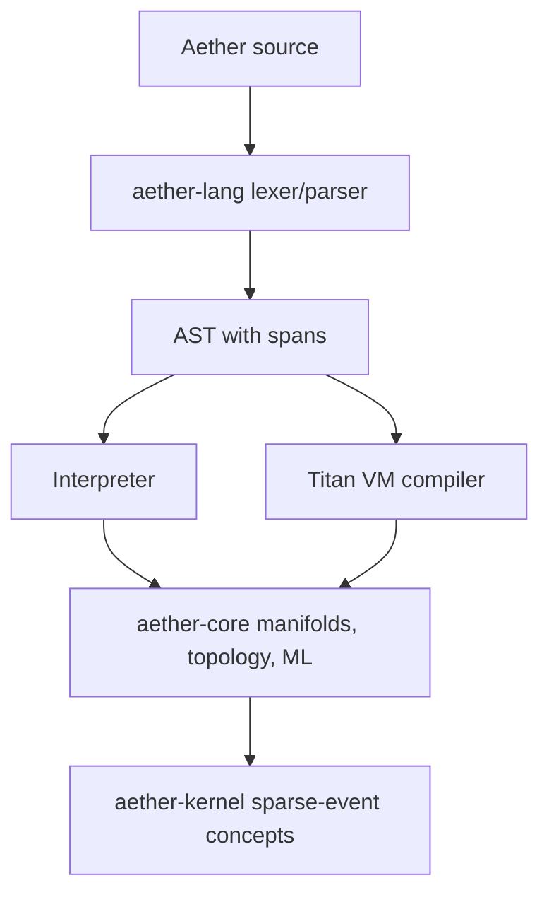

# Architecture

The current architecture documentation is split by contract:

- [Runtime Surface](concepts/runtime-surface.md)
- [Language Pipeline](concepts/language-pipeline.md)
- [Execution Model](language/execution-model.md)
- [Persistent Homology](topology/persistent-homology.md)
- [Derivations](topology/derivations.md)
- [Sparse Events](kernel/sparse-events.md)
- [Hardware Boundary](kernel/hardware-boundary.md)

## System View

The public architecture claim is the composition of these crates. Hardware,
security, and speed claims require the evidence gates listed in
[Evidence Gates](benchmarks/evidence-gates.md).
