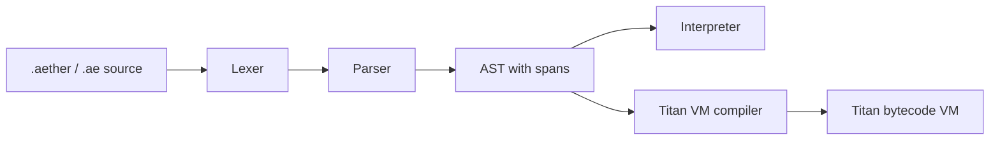

# Language Pipeline

Aether source moves through four local stages.

## Lexer

File: `crates/aether-lang/src/lexer.rs`

The lexer emits token kinds for:

- language structure: `let`, `fn`, `class`, `return`, `import`, `from`;
- control flow: `if`, `else`, `while`, `for`, `in`, `break`, `continue`;
- topology loop form: `seal` and its Unicode alias;
- manifold forms: `manifold`, `block`, `regress`, `render`, `embed`;
- operators: arithmetic, comparison, logical, range, and terminator tokens;
- literals: numbers, fixed-precision floats, strings, booleans, identifiers.

Errors are emitted as `TokenKind::Error` and later surfaced by the parser with
source position.

## Parser

File: `crates/aether-lang/src/parser.rs`

The parser is recursive descent. It builds `Program`, `Statement`, and `Expr`
nodes from the token stream. Parsed statements include:

- `manifold M = embed(...)`;
- `block B = M.cluster(...)` and indexed block extraction;
- `regress { ... }`;
- `render M { ... }`;
- `let` declarations and assignment;
- imports;
- classes;
- `if`, `while`, `for`, `seal until`, functions, `return`, `break`, and
  `continue`;
- expression statements.

Every AST wrapper has a source span. This is the diagnostic boundary used by
parse errors and future static checks.

## Interpreter

File: `crates/aether-lang/src/interpreter.rs`

The interpreter maps AST nodes into runtime values. Its active value set
includes numbers, booleans, strings, lists, tensors, manifolds, blocks,
persistence diagrams, functions, classes, objects, modules, native functions,
and ML objects.

## Titan VM

File: `crates/aether-lang/src/vm.rs`

The Titan VM compiles AST into a stack-oriented bytecode form. The VM is an
active implementation surface, but language parity with the interpreter should
be treated as gated until each construct has VM-specific tests.
