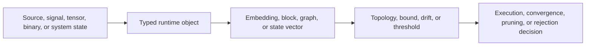

<div class="ts-hero" markdown>
<div class="ts-hero-card" markdown>
<p class="ts-kicker">Aether Lang · part of <a href="https://teerthsharma.vercel.app/">Seal's Topology Land</a></p>

# A runtime whose loops stop when their shape does.

A small language where `🦭 until` ends a loop on a condition, persistent homology is a
built-in call, and every capability on this site is either tested or labelled roadmap.

<div class="ts-chips" markdown>
[Get started](GETTING_STARTED.md){ .ts-chip .ts-chip--primary }
[Language](language/syntax.md){ .ts-chip }
[Topology](topology/persistent-homology.md){ .ts-chip }
[Status matrix](reference/status.md){ .ts-chip }
[GitHub](https://github.com/teerthsharma/Aether-Lang){ .ts-chip }
</div>
</div>

```text
let count = 0~

🦭 until count >= 10 {
    count = count + 1~
}
```
</div>

## What it is

Aether Lang documents the language runtime and core systems as a set of bounded
contracts. The central idea is that ordinary engineering constraints can expose
useful behavior when the runtime preserves structure:



<div class="ts-viz" data-viz="pipe-flow" data-title="One example through the flow" data-caption="A list becomes a 3D time-delay embedding, the Rips radius joins its points, and β0 feeds the decision; edit data, τ or radius."></div>


## What Is Active Today

- Lexer, parser, AST, interpreter, and Titan VM scaffolding in `aether-lang`.
- CLI commands: `aether repl`, `aether run`, and `aether check`.
- Variables, assignments, arithmetic, comparison, logical operators, lists,
  functions, `if`, `while`, `for`, and `seal until`.
- Manifold embedding from numeric lists through a fixed 3D time-delay workspace.
- Block extraction and geometric block metadata.
- Bounded persistent homology over Vietoris-Rips and lazy witness complexes.
- DSL topology calls: `topology.ph`, `topology.betti`, and
  `topology.intervals`.
- ML primitives in `aether-core`: tensors, losses, regression, clustering,
  classification, neural layers, autograd scaffolding, convolution, data
  loading, and gossip consensus.
- Sparse-event scheduler and geometric governor tests in the kernel/core stack.

## What Is Roadmap Or Gated

- Hardware acceleration and GPU claims.
- Production security claims for binary authentication.
- End-to-end benchmark speedups.
- Full language-level type checking.
- Framework parity with PyTorch, TensorFlow, CUDA, or Triton.
- Bare-metal bootability as a user-facing distribution target.

Those surfaces can be implemented, but the docs should not describe them as
active capabilities until tests and artifacts cover the claim.

## Learning Path

1. Read the language pipeline to understand source-to-runtime flow.
2. Read persistent homology and derivations before relying on topology terms.
3. Read the runtime surface and status matrix to separate active behavior from
   scaffolding.
4. Run the local checks before trusting any performance or backend statement.

## Evidence Policy

Every active claim should have one of three forms:

- a unit test or integration test;
- a runnable CLI or benchmark artifact;
- a docs-only theory or roadmap statement clearly labeled as such.

This keeps the project legible without turning planned systems into active
claims.
